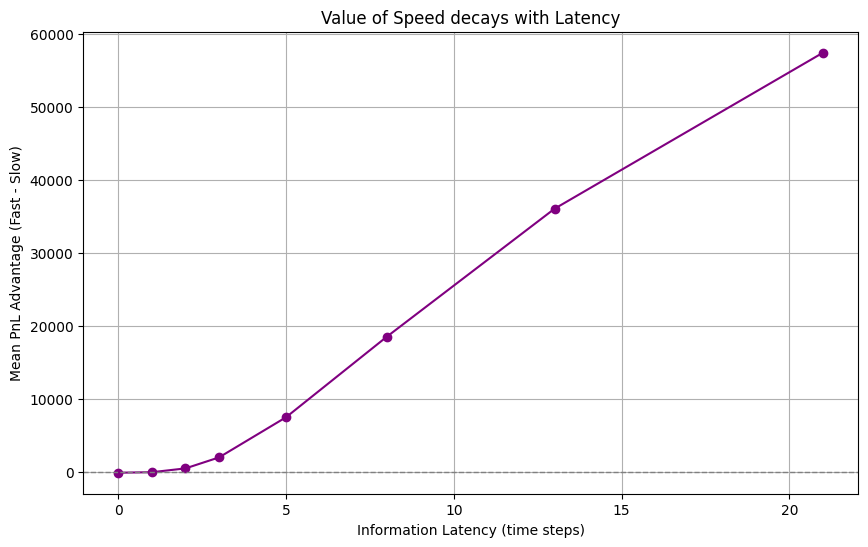

# Project: Latency Arbitrage Simulation Framework

## Overview

This project studies the **economic value of speed** in electronic markets.

I build a minimal agent-based model in which multiple traders observe the same underlying value process with different delays and compete against a market maker posting quotes based on imperfect information. All agents follow the same rational decision rule; the only difference is when they see the information.

The goal is to isolate when and why execution latency creates real trading advantage, and when that advantage disappears.

## Core Question

> When does speed create economic value; and when does it not?

More precisely:
- How does expected PnL decay as a trader's information or execution latency increases?
- How do market maker updates, spreads and liquidity dynamics limit latency arbitrage?
- Can smarter quoting or batching neutralize speed advantages?

## Model

### Latent Value

A single "true value" process

$$ V_t = V_{t-1} + \epsilon_t, \\quad \epsilon_t \sim N(0, \sigma^2) $$

### Market Maker

- Posts bid/ask quotes around a lagged estimate of the latent value
- Earns the spread but faces adverse selection from faster traders
- Maintains finite bid and ask depth with stochastic refill

Two variants:
- **Naive MM:** quotes based on lagged value with fixed spread
- **Smart MM (extension):** adaptive mid and spread using EWMA volatility estimation

### Traders

Two traders with identical logic but different information timing
- **Fast Trader**
    - Observes signals with minimal delay
    - Acts immediately on fresh information
- **Slow Trader**
    - Observes delayed or aggregated signals
    - Faces adverse selection and reduced expected value

For both type of traders, signals take the form:

$$ S_{t}^{(i)} = V_{t-\ell_i} + \eta_t $$

## Decision Rule

Both traders use the same rational rule:

$$ Trade \\quad if \mathbb{E}[\Delta V \mid S_t] > \frac{spread}{2} + \text{impact} $$

- Speed does not change intelligence
- Speed changes the information set
- Latency directly reduces conditional expected value

## Experiments

The main experiment is a latency sweep:
- Vary trader latency $\ell$
- Run Monte Carlo simulations
- Measure:
    - Mean PnL
    - Std of PnL
    - Distribution of outcomes

Key outputs:
- PnL advantage vs Latency curves
- Demonstration of alpha decay with delay
- Identification of regimes where latency arbitrage disappears

## Experimental Parameters

Simulations use a stylized but economically consistent market setup:

- **Latent value volatility (σ):** Controls how quickly information becomes stale.
- **Bid-ask spread:** Proxy for transaction costs and adverse selection buffer.
- **Market Maker lag:** Determines how long quotes remain stale.
- **Liquidity depth:** Finite depth at best bid/ask limits trade size
- **Impact coefficient:** Linear price impact per unit traded.
- **Inventory policy:** Trader inventories are flattened each timestep  to isolate pickoff economics rather than directional exposure.
- **Monte Carlo runs:** Results are averaged over 100 independent simulations to ensure statistical stability.

These parameters are held fixed across latency values to isolate the effect of information timing.

Representative values used in experiments:
- Latent volatility σ = 0.2
- Bid-ask spread = 0.5
- Market Maker lag = 2 timesteps
- Base depth = 10 units
- Impact coefficient = 0.01

## Results and Insights

The core experiment measures how trading performance changes as information latency increases.

The table below summarizes mean PnL outcomes (averaged over 100 MC runs) for selected latency values:

| Latency | Fast Trader | Slow Trader | Advantage (Fast − Slow) |
|-------:|------------:|------------:|-------------------------:|
| 0 | −112 | −14 | −98 |
| 3 | −112 | −2,113 | +2,001 |
| 8 | −112 | −18,642 | +18,530 |
| 21 | −112 | −57,554 | +57,442 |

While absolute PnL is negative due to transaction costs in a fair market, the relative advantage of the fast trader grows rapidly as information becomes stale.



This demonstrates that speed creates value not by generating alpha, but by avoiding adverse selection against slower participants.

### Conclusion
Speed creates value only when information arrives before prices adjusts; otherwise imapct and adverse selection dominate.

## Repo Structure

```graphql
core/
  model.py        # Latent value + execution loop
  market.py       # Market maker and execution logic
  traders.py      # Fast and slow trader definitions
  experiments.py  # Latency sweep and statistics

research/
  smart_mm.py     # Adaptive quoting extensions
  batching.py     # Auction / batching experiments
  depth_models.py # Alternative liquidity dynamics
```
The `core/` folder contains a minimal self-contained model
The `research/` folder explores extensions and robustness checks

## Project Relevance

This project emphasizes:
- Decision making under uncertainty
- Information timing and conditioning
- Market microstructure

## Possible Extensions

- Multi-agent competition among fast traders
- Endogenous spread optimization
- Queue position and limit order modelling
- Continuos time limits
- Empirical calibration to real tick data

## Takeaway

- Speed creates value only by changing the information set, not the strategy
- Latency rapidly destroys conditional expected value
- Adaptive market making and impact costs tightly bound the value of speed
